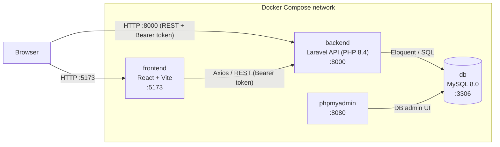
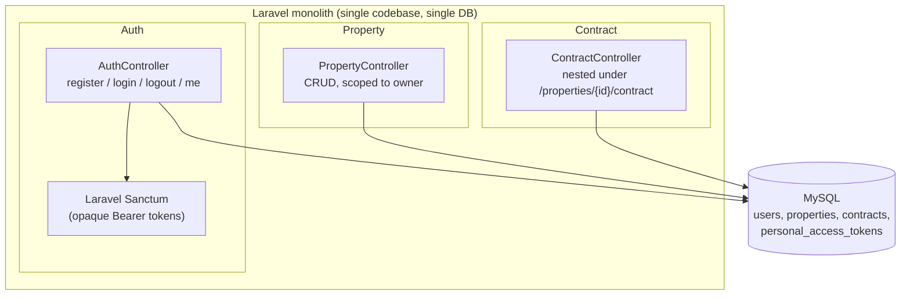
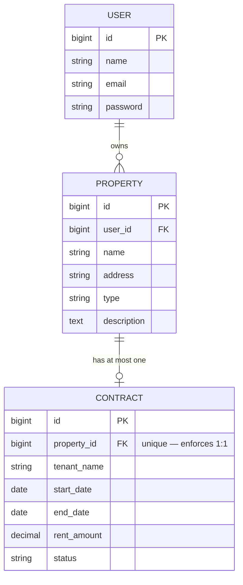
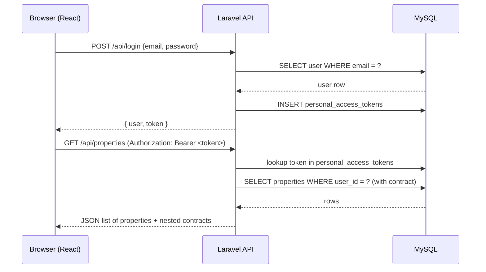

# Current Architecture — Laravel Monolith

This is a snapshot of the system as it exists today: a single Laravel application
that owns all three domains (User, Property, Contract), backed by one MySQL
database, with a separate React SPA talking to it over a REST API.

## Deployment view (Docker Compose)

## Inside the monolith

Everything — auth, properties, and contracts — lives in one Laravel codebase
and shares one database. There are no service boundaries yet; modules are
just folders/namespaces within the same app.

## Domain model (entity relationships)

## Request flow: authenticated property fetch

## Notes on this stage

- **Single deployable unit** — frontend is separate, but Auth, Property, and
  Contract are one Laravel app sharing one database and one auth mechanism
  (Sanctum's DB-backed Bearer tokens).
- **Authorization is enforced in controllers** — every Property/Contract
  endpoint checks `property.user_id === authenticated user.id`; no cross-user
  access is possible via the API.
- **This is the baseline for the migration** — the planned first extraction is
  the User/Auth module into its own Node service (see migration notes for how
  JWT, event-driven sync, and service-to-service auth come into play once that
  split begins).
