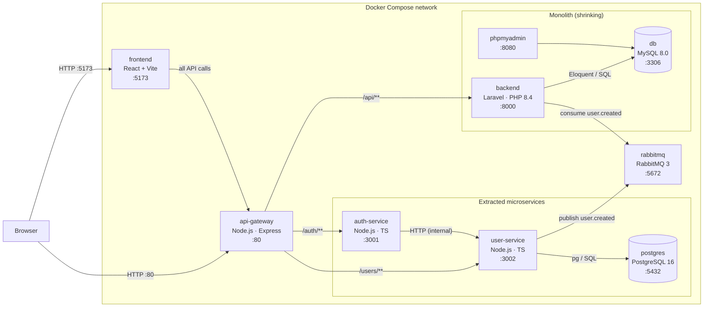
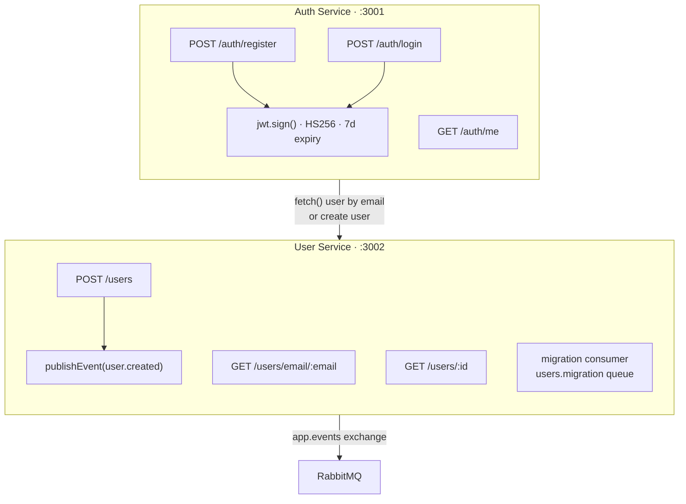
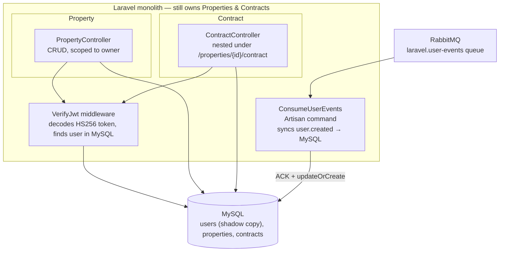
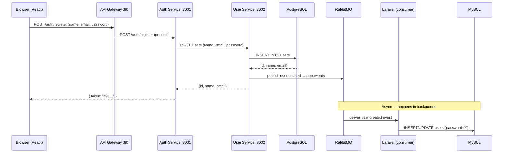
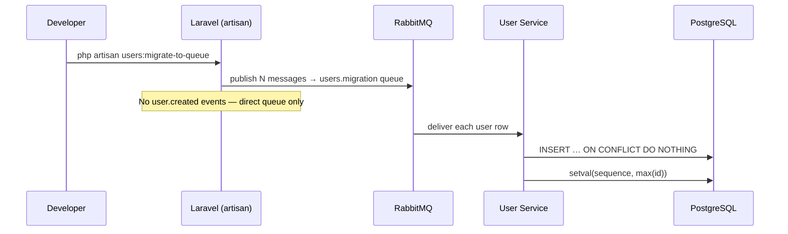

# Transitional Architecture — Strangler-Fig in Progress

This document captures the system mid-migration: Auth and User domains have been
extracted into their own services, while Properties and Contracts still live in
the Laravel monolith. An API Gateway sits in front of everything.

## Deployment view (Docker Compose)

## Inside the extracted services

## Inside the monolith (unchanged domains)

## Event flow: new user registration

## Event flow: bulk migration (one-off)

## Authentication: before vs. after

| Concern | Monolith (before) | Transitional (now) |
|---|---|---|
| Token type | Sanctum opaque Bearer token (DB-backed) | HS256 JWT (stateless) |
| User store | MySQL `users` table | PostgreSQL `users` table (canonical) |
| Login flow | Laravel reads MySQL directly | Auth Svc → User Svc → PostgreSQL |
| JWT verification | N/A — Sanctum middleware | `VerifyJwt` Artisan middleware decodes JWT |
| MySQL `users` | Canonical source of truth | Shadow copy (synced via `user.created` events, password `*`) |

## What has and hasn't changed for the frontend

The React app now points at `http://localhost` (port 80) instead of `:8000`.
All routes it previously called still work — the gateway proxies them
transparently. No changes to the React source were needed beyond the base URL.

## Key architectural decisions

- **No separate event-manager service** — RabbitMQ topic exchange `app.events`
  with routing key `entity.action` IS the event bus. Any service binds its own
  queue with a pattern filter.
- **Auth Service is stateless** — it has no database of its own. All persistence
  goes through User Service via synchronous HTTP.
- **Bulk migration fires no events** — the `users.migration` direct queue
  bypasses the `POST /users` route (which publishes events) so migrated users
  don't spam the event bus.
- **User IDs preserved** — MySQL IDs are kept intact in PostgreSQL so existing
  JWTs (`sub` claim) survive the migration without token invalidation.
- **http-proxy-middleware v2 quirk** — Express does NOT strip the mount prefix
  before the proxy sees `req.url`. Full path arrives at upstream intact — no
  `pathRewrite` needed.

## What's next (planned extractions)

| Service | Status |
|---|---|
| Auth Service | ✅ Extracted |
| User Service | ✅ Extracted |
| Properties Service | ⬜ Planned |
| Contracts Service | ⬜ Planned |
